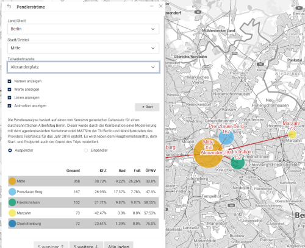

Masterportal Addon CommuterFlows (Tool)
======================================================
[Masterportal](https://bitbucket.org/geowerkstatt-hamburg/masterportal/src/dev/) CommuterFlows Addon zur Verwendung in der "Digitale Plattform Stadtverkehr - Berlin"-Plattform.

Das Plugin basiert auf dem [CommuterFlows-Plugins der Geowerkstatt Hamburg](https://bitbucket.org/geowerkstatt-hamburg/addons/src/dev/commuterFlows/) und dient der Visualisierung von Pendlerdaten aus der Verkehrsdatenanalyse.
In der vorliegenden Variante wurden Anpassungen aufgrund der abweichenden Gebietseinteilung in Berlin vorgenommen, sowie eine Unterteilung nach Verkehrstyp eingebaut.

Das Plugin ist mit der Masterportal Version 3.5.1 getestet.

Das Addon im Einsatz kann in der [Digitalen Plattform Stadtverkehr Berlin](https://viz.berlin.de/site/_masterportal/berlin/index.html?commuterFlows=true) betrachtet werden.
Die dazu passende [Konfiguration](https://github.com/digitale-plattform-stadtverkehr-berlin/masterportal-dps-config/blob/master/berlin/config.json) steht ebenfalls zu Verfügung.
